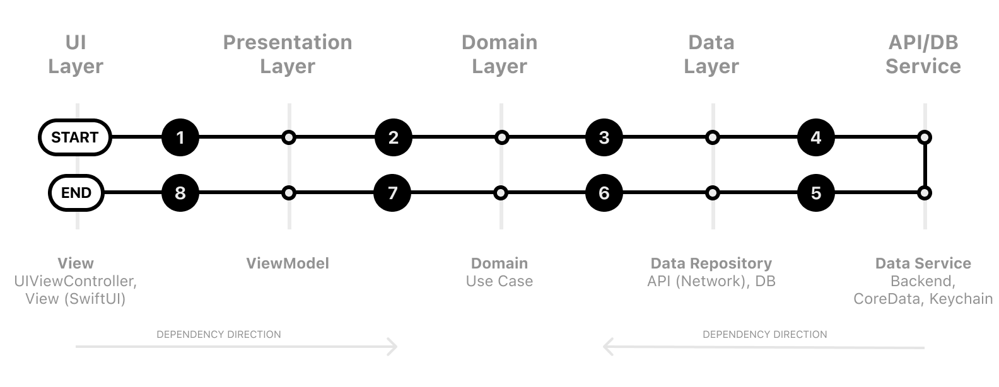

# `{Project Name}` iOS

- [Overview](#overview)
- [Getting Started](#getting-started)
- [Installation](#installation)
- [Conventions](#conventions)
- [Environments](#environments)
- [Troubleshooting](#troubleshooting)
- [Contributing](#contributing)
- [Releasing](#releasing)
- [Known Issues](#known-issues)

## Overview

_This document is a template for README files of any Koombea iOS project. Please use this as to enforce the project guidelines and conventions, as well as any other development process of the team. Replace this paragraph for a project introduction._

## Getting Started

### Submodules

We follow the Clean Architecture+MVVM pattern to make our projects easy to read and mantain. Our projects are divided in three main modules: Presentantion, Domain and Data.



### Presentation
Presentation Layer contains UI (UIViewControllers or SwiftUI Views). Views are coordinated by ViewModels (Presenters) which execute one or many Use Cases. Presentation Layer **depends only** on the **Domain Layer**.

- Coordinators
- ViewModels
- Factories
- UI Components

### Domain
Domain Layer (Business logic) is the inner-most part of the onion (without dependencies to other layers, it is totally isolated). It contains Entities(Business Models), Use Cases, and Repository Interfaces. This layer could be potentially reused within different projects. Such separation allows for not using the host app within the test target because **no dependencies (also 3rd party) are needed** — this makes the Domain Use Cases tests take just a few seconds. **Note:** Domain Layer **should not include** anything from other layers(e.g Presentation — UIKit or SwiftUI or Data Layer — Mapping Codable)

- Base classes, structs, and enums
- Protocols Repositories
- Use cases
- Data Transfer Objects (DTO)

### Data
Data Layer contains Repository Implementations and one or many Data Sources. Repositories are responsible for coordinating data from different Data Sources. Data Source can be Remote or Local (for example persistent database). Data Layer **depends only** on the **Domain Layer**. In this layer, we can also add mapping of Network JSON Data (e.g. Decodable conformance) to Domain Models.

- Implementations Repositories

## Installation

Use [Xcode](https://apps.apple.com/us/app/xcode/id497799835?mt=12) latest version to run this apps. This can be downloaded directly from the mac app store. Then open the `{Project Name}.xcodeproj` file and choose the scheme for the app you want to run as described in the [Environments](#environments) section.

### Dependencies

This project uses [Swift Package Manager](https://swift.org/package-manager/) as its main dependency manager as well as [Carthage](https://github.com/Carthage/Carthage) as an alternative dependency manager for those libraries that doesn't have support for SPM. However there are some dependecies linked manually which don't support SPM nor Carthage.

The list of project dependencies can be found at the `{Project Name}.xcodeproj` using Xcode and navigating to Project > Package Dependencies.

Before adding any new library to the project, a state-of-the-art analysis has to be done. Use the [libraries decision matrix log]({Document-URL}) to keep track of the options available at a the moment and the decision making process.

The _Technical Lead_ will be responsible for choosing the one that is best suited for the project before integrate it.

## How to use Xcode templates for new features

Xcode templates are a great tool for speeding up our development workflow by creating files for us automatically. Given that this template is based on a Clean Architechture, whenever we need to develop a new feature we must create a bunch of files, e.g: viewmodels, models, repostiories, coordinators, viewcontrollers, etc.

This Xcode template aims to reduce the boilerplate by creating all this files for us with some few click. Let's dive in!

### How to install the Xcode template

1. Open a terminal and navigate to the current folder project
2. Type the following command:

```console
sh install_template.sh
```

3. You will see the following output:

```console
[DEBUG] Using Xcode path /Applications/Xcode14.3.app/Contents/Developer
[DEBUG] Checking if template folder exists ...
[DEBUG] Template folder exists.
[DEBUG] Checking if Clean folder exists.
[DEBUG] Clean folder exists.
[DEBUG] Checking if template workspace exists.
[DEBUG] Template workspace exists.
[DEBUG] Copying template files ...
[DEBUG] Completed.
```

4. Once it says `Completed` you can start using the templates in Xcode.

### How to use Xcode templates to create a new feature

1. Inside your Xcode project, navigate to the root node on the Navigator Pane

   

2. Right click and select `Create new file` or just press `CMD + N`
3. A prompt will appear, look for the search bar and type the word `clean`

   

4. Inside the `iOS App Template` section you will find an icon called `Clean Feature Template`

   

5. Click on `Next`
6. Write down a name for the repository you want to use and also a name for the feature.

   > **ℹ️ Note:** > **these names are going to be used as part of Class names and variable names, so try to be as meaningful as possible.**

   

7. A file dialog will appear, just make sure to NOT CHANGE the default location, just go straight to the `Create` button and click on it.

   

8. Once everything is completed, some files would be created automatically and the folder structure would look like this.

   

9. Next step is to make sure the app compiles without errors.

   

### Where to go from here?

Now that you have all the boilerplate for a new feature, the only thing that is missing is you to start developing the feature according to the design and requirements.

### Have some feedback?

Let's have some conversation about it in [#ios-template](https://koombea.slack.com/archives/C049854GK8W) Slack channel or send me an email to [carlos.triana@koombea.com](mailto:carlos.triana@koombea.com).

### Distribution

The alpha versions of this app are distributed using Firebase Distribution. An the beta builds and productions builds using Apple Testflight and App Store services.

## Conventions

As a best practice follow these guidelines:

1. Follow [Swift's API design guidelines](https://www.swift.org/documentation/api-design-guidelines/) for naming conventions.
2. Follow Ray Wenderlich's [Swift Style Guide](https://github.com/raywenderlich/swift-style-guide) for coding style.
3. Use [SwiftLint](https://github.com/realm/SwiftLint) to enforce the project's Swift style and conventions.conventions. This requires a binary to be installed in your machine. See more [here](https://github.com/realm/SwiftLint/blob/master/README.md#installation) for installation instructions.
4. Use [semantic versioning](https://semver.org) for any beta or production releases.
5. Use Git Flow as your git workflow and branch naming convention. For more information, see our [contributing](../Shared/CONTRIBUTING.md) guide.

## Environments

This project has different Xcode schemes to run the app pointing to different environments:

### Production

Use the following for _App Store_ releases:

- `{Project Name} Prod` (Xcode scheme)
- Backend: [Backend]({Backend-URL})
- Error tracking: [Crashlytics]({Crashlytics-URL})

### Staging

Use the following for _testing_ releases:

- `{Project Name} Stag` (Xcode scheme)
- Backend: [Backend]({Backend-URL})
- Error tracking: [Crashlytics]({Crashlytics-URL})

### Development

Use the following Xcode schemes for _development_ or running the app locally:

- `{Project Name} Dev` (Xcode scheme)
- Backend: [Backend]({Backend-URL})
- Error tracking: [Crashlytics]({Crashlytics-URL})

## Troubleshooting

### Logs

Debug logs will be output to the Xcode's console. To intercept network requests you can use some tools like [Proxyman](https://proxyman.io). Remote logs would be available in the error tracking service for each environment as described in the [Environments](#environments) section.

[Add any additional instuctions to access the logs]: text

### Certificate issues

To be able to run the apps on devices directly from Xcode you will need a development certificate and mobile provisioning files installed in your machine. Those can be obtained from the [Apple Developer portal](http://developer.apple.com/account/).

## Contributing

The master branch of this repository contains the latest stable source code for the production environment. This branch and the develop branch are protected to prevent those from being accidentally deleted. Force pushes are also disabled to enforce following the process described in the Releasing section.

Please follow this steps for submitting any changes:

Create a new branch for any new feature.
Make sure you include tests for your changes.
When the feature is complete, create a pull request to the develop branch.

### Continuous Integration

When a change is merged into the `develop` branch the CI service ([Bitrise]({Bitrise-Project-URL})) will automatically run the tests and generate a new build for testing.

When a change is merged into the `master` branch the CI service will automatically run the tests and generate a new build for production.

Bitrise workflow scripts will look for some keywords into the commit message to generate app builds accordingly.

- To generate a _App-1_ app build use
  `App1Keyword:` or `[app-1-tag]`
- To generate a _App-2_ app build use
  `App2Keyword:` or `[app-2-tag]`

After a build is generated of fail, a message will be posted to the team's slack channel.

For more information, see our [contributing](../Shared/CONTRIBUTING.md) guide.

## Releasing

All releases to the main branches (`main` and `develop`) must be code reviewed and approved before being merged by the team's _Release Manager_ following this steps:

### Checklist

1. Fill the [pull request template](.github/PULL_REQUEST_TEMPLATE.md) for every pull request.
2. After a pull request is submitted, the developer must assign the teammates to make a code review.
3. Once the code review is finished and changes are approved, the _QA Analyst_ would be automatically(?) notified to do the smoke testing.
4. If all tests passes, and the _QA Analyst_ does not find any issue the code can be merged by the _Release Manager_.
5. When all the features planned for a release are done, the _Release Manager_ will be in charge of approving and merging the changes to the `master` branch.
6. The _QA Analyst_ must do a full regression test of the production environment to make sure the new changes did not affect any other functionality.

## Known Issues

[Include Jira filter link that matches to the repo type. Example: https://koombea.atlassian.net/browse/TH-990?filter=10573]: text

_Add the [Jira filter link](URL)_

## License

Copyright © 2022 Koombea®. All rights reserved.
